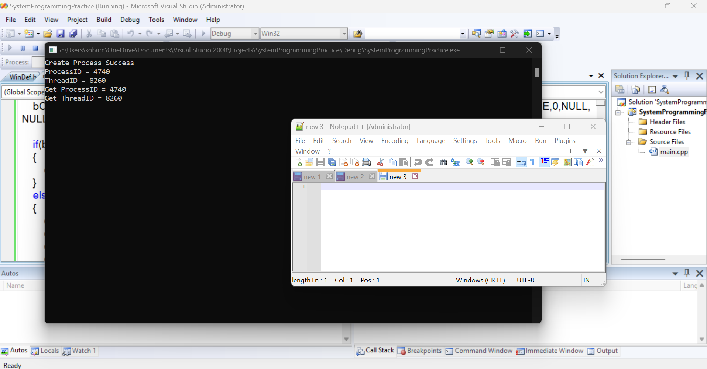

# Win32 APIs

## 01 Create Directory

```cpp
#include<windows.h>
#include<iostream>
using namespace std;
int main()
{
	BOOL bDir = CreateDirectory(L"D:\\hello",NULL);

	if(bDir == FALSE)
	{
		cout<<"Create Directory Failed, Error No = "<<GetLastError()<<endl;
		system("PAUSE");
		return 1;
	}

	cout<<"Create Directory Success"<<endl;
	system("PAUSE");
		return 0;
}
```

---

## 02 Remove Directory

```cpp
#include <windows.h>
#include <iostream>
using namespace std;
int main()
{
  BOOL bDir;

  bDir = RemoveDirectory(L"D:\\hello");

  if (bDir == FALSE)
  {
    cerr << "Error Deleting Directory, Error No = " << GetLastError() << endl;
    system("PAUSE");
    return 0;
  }

  cout << "Directory Deleted Successfully" << endl;
  system("PAUSE");

  return 0;
}
```

---
## 03 Copy File

```cpp
#include <windows.h>
#include <iostream>
using namespace std;
int main()
{
  BOOL bDir = CopyFile(L"D:\\person3.csv", L"D:\\hello\\person3.csv", TRUE);

  if (bDir == FALSE)
  {
    cerr << "Copy File Failed, Error No = " << GetLastError() << endl;
    system("PAUSE");
    return 1;
  }

  cerr << "Copy File Success" << endl;
  system("PAUSE");
  return 0;
}
```

---

## 04 Move File

```cpp
#include <windows.h>
#include <iostream>
using namespace std;
int main()
{
  BOOL bDir = MoveFile(L"D:\Soham's Notebook.url.csv", L"D:\\hello\\Soham's Notebook.url.csv");

  if (bDir == FALSE)
  {
    cerr << "Move File Failed, Error No = " << GetLastError() << endl;
    system("PAUSE");
    return 1;
  }

  cout << "Move File Success" << endl;
  system("PAUSE");
  return 0;
}
```

---

## 05 Create File

```cpp
#include <windows.h>
#include <iostream>
using namespace std;
int main()
{
  HANDLE hFile = CreateFile(L"D:\\hello\\demo.txt", GENERIC_READ | GENERIC_WRITE, FILE_SHARE_READ, NULL, CREATE_NEW, FILE_ATTRIBUTE_NORMAL, NULL);

  if (hFile == INVALID_HANDLE_VALUE)
  {
    cerr << "Create File Failed, Error No = " << GetLastError() << endl;
    system("PAUSE");
    return 1;
  }
  cout << "Create File Success" << endl;
  system("PAUSE");
  return 0;
}
```

---

## 06 Write File

```cpp
#include <windows.h>
#include <iostream>
using namespace std;
int main()
{
  HANDLE hFile = CreateFile(L"D:\\hello\\demo.txt", GENERIC_READ | GENERIC_WRITE, FILE_SHARE_READ, NULL, CREATE_NEW, FILE_ATTRIBUTE_NORMAL, NULL);

  if (hFile == INVALID_HANDLE_VALUE)
  {
    cerr << "Create File Failed, Error No = " << GetLastError() << endl;
    system("PAUSE");
    return 1;
  }
  cout << "Create File Success" << endl;
  system("PAUSE");

  char chBuffer[] = "this is a demo file";
  DWORD dwNoByteToWirte = strlen(chBuffer);
  DWORD dwNoByteWritten = 0;

  BOOL bFile = WriteFile(hFile, chBuffer, dwNoByteToWirte, &dwNoByteWritten, NULL);

  if (bFile == FALSE)
  {
    cerr << "Error Writing data into file, Error No = " << GetLastError() << endl;
    system("PAUSE");
    return 1;
  }

  cerr << "Success Writing data into file" << endl;
  system("PAUSE");

  return 0;
}
```

---

## 07 Create Hard Link

```cpp
#include <windows.h>
#include <iostream>
using namespace std;
int main()
{
  BOOL bHfile = CreateHardLink(L"D:\\hello\\person4.csv", L"D:\\hello\\person3.csv", NULL);

  if (bHfile == FALSE)
  {
    cerr << "Create Hard Link failed, Erro No = " << GetLastError() << endl;
    system("PAUSE");
    return 1;
  }

  cout << "Create Hard Link Success" << endl;
  system("PAUSE");
  return 0;
}
```

---

## 08 Create Soft Link

```cpp
#include <windows.h>
#include <iostream>
using namespace std;
int main()
{
  BOOL bHfile = CreateSymbolicLink(L"D:\\hello\\person3-shortcut.csv", L"D:\\hello\\person3.csv", 0);

  if (bHfile == FALSE)
  {
    cerr << "Create Soft Link failed, Erro No = " << GetLastError() << endl;
    system("PAUSE");
    return 1;
  }

  cout << "Create Soft Link Success" << endl;
  system("PAUSE");
  return 0;
}
```

---

## 09 Reg Create Key

```cpp
#include <windows.h>
#include <iostream>
using namespace std;
int main()
{
  HKEY hKey;
  LONG lReg = RegCreateKeyEx(HKEY_LOCAL_MACHINE, L"Software\\Test\\Product\\SmartId", 0, NULL, REG_OPTION_NON_VOLATILE, KEY_ALL_ACCESS | KEY_WOW64_64KEY, NULL, &hKey, NULL);

  if (lReg != ERROR_SUCCESS)
  {
    cerr << "Registry Creation failed, Erro No = " << GetLastError() << endl;
    system("PAUSE");
    return 1;
  }

  cout << "Registry Creation Success" << endl;
  RegCloseKey(hKey);
  system("PAUSE");
  return 0;
}
```

---

## 10 Reg Set Value

```cpp
#include <windows.h>
#include <iostream>
using namespace std;
int main()
{
  HKEY hKey;
  DWORD dwData = 1234;
  LONG lReg = RegCreateKeyEx(HKEY_LOCAL_MACHINE, L"Software\\Test\\Product\\SmartId", 0, NULL, REG_OPTION_NON_VOLATILE, KEY_ALL_ACCESS | KEY_WOW64_64KEY, NULL, &hKey, NULL);

  if (lReg != ERROR_SUCCESS)
  {
    cerr << "Registry Creation failed, Erro No = " << GetLastError() << endl;
    system("PAUSE");
    return 1;
  }

  cout << "Registry Creation Success" << endl;

  lReg = RegSetValueEx(hKey, L"Value", NULL, REG_DWORD, (LPBYTE)&dwData, sizeof(dwData));

  if (lReg != ERROR_SUCCESS)
  {
    cerr << "Error Setting data in Registry, Error No = " << GetLastError() << endl;
    system("PAUSE");
    return 1;
  }

  cout << "Registry Set Value success " << endl;

  RegCloseKey(hKey);

  cout << "Registry Close success " << endl;
  system("PAUSE");
  return 0;
}
```

---

## 11 Create Process

```cpp
#include<iostream>
#include<windows.h>
using namespace std;

int main()
{
	HANDLE hProcess = NULL;
	HANDLE hThread = NULL;
	STARTUPINFO si;
	PROCESS_INFORMATION pi;
	DWORD dwProcessId = 0;
	DWORD dwThreadId = 0;
	ZeroMemory(&si,sizeof(si));
	ZeroMemory(&pi,sizeof(pi));

	BOOL bCreateProcess = NULL;
	bCreateProcess = CreateProcess(L"C:\\Program Files\\Notepad++\\notepad++.exe",NULL,NULL,NULL,FALSE,0,NULL,NULL,&si,&pi);

	if(bCreateProcess == FALSE)
	{
		cerr<<"Create Process Failed - "<<GetLastError()<<endl;
	}
	else
	{
		cout<<"Create Process Success"<<endl;
		cout<<"ProcessID = "<<pi.dwProcessId<<endl;
		cout<<"ThreadID = "<<pi.dwThreadId<<endl;
		cout<<"Get ProcessID = "<<GetProcessId(pi.hProcess)<<endl;
		cout<<"Get ThreadID = "<<GetThreadId(pi.hThread)<<endl;

		WaitForSingleObject(pi.hProcess,INFINITE);
		CloseHandle(hProcess);
		CloseHandle(hThread);
	}

	system("PAUSE");
}
```




---

## 12 Create Thread  

```cpp
#include<windows.h>
#include<iostream>
using namespace std;

DWORD WINAPI ThreadFun(LPVOID lparam);

int main()
{
	HANDLE hThread = NULL;
	DWORD dwThreadID = NULL;

	hThread = CreateThread(
		NULL,
		0,
		ThreadFun,
		NULL,
		0,
		&dwThreadID);

	if(hThread == NULL)
	{
		cout<<"Thread Creation Failed, Error = "<<GetLastError()<<endl;
		system("PAUSE");
		return 0;
	}

	cout<<"Thread Creation Success"<<endl;
	cout<<"ThreadID = "<<dwThreadID<<endl;
	CloseHandle(hThread);
	system("PAUSE");

}

DWORD WINAPI ThreadFun(LPVOID lparam)
{
	cout<<"Thread Fun Running ";
	Sleep(5000);
	return 0;
}
```

### Code Screenshot


---

## 13 Addition Using Thread

```cpp
#include<iostream>
#include<windows.h>
using namespace std;

int a[2];
DWORD WINAPI ThreadFun(LPVOID lParam);

int main()
{
  DWORD dwThreadID = NULL;
  cout<<"Enter 1 num : "<<endl;
  cin>>a[0];
  cout<<"Enter 2 num : "<<endl;
  cin>>a[1];
  cout<<"Thread Created";

  HANDLE hThread = CreateThread(
    NULL,
    0,
    ThreadFun,
    (void*)&a,
    0,
    &dwThreadID);

  CloseHandle(hThread);
  cout<<"Thread Closed"<<endl;
  system("PAUSE");
}

DWORD WINAPI ThreadFun(LPVOID lParam)
{
  cout<<"Result = "<<a[0]+a[1]<<endl;
  return 0;
}
```

## Output Screenshot


--- 

## 14 UnNamed Mutex

```cpp
// UnNamed Mutex
#include<iostream>
#include<windows.h>
using namespace std;

int main()
{
  HANDLE hMutex = NULL;
  hMutex = CreateMutex(NULL,FALSE,NULL);

  if(hMutex = NULL)
  {
    cerr<<"Error Creating Mutex, Error No : "<<GetLastError()<<endl;
    system("PAUSE");
    return 0;
  }

  cout<<"Mutex Creation Success"<<endl;
  CloseHandle(hMutex);
  system("PAUSE");
  return 0;
}
```

## Output Screenshot


---

## 15 Named Mutex

```cpp
#include<iostream>
#include<windows.h>
using namespace std;

int main()
{
  HANDLE hMutex = NULL;
  cout<<"MyMutex"<<endl;
  hMutex = CreateMutex(NULL,FALSE,L"MyMutex");

  if(hMutex = NULL)
  {
    cerr<<"Error Creating Mutex, Error No : "<<GetLastError()<<endl;
    system("PAUSE");
    return 0;
  }

  cout<<"Mutex Creation Success"<<endl;
  //CloseHandle(hMutex);
  system("PAUSE");
  return 0;
}
```

## Output Screenshot


---

## 16 Open Mutex

```cpp
#include<iostream>
#include<windows.h>
using namespace std;

int main()
{
  HANDLE hMutex = NULL;
  cout<<"Open Mutex Fun"<<endl;
  hMutex = OpenMutex(MUTEX_ALL_ACCESS,FALSE,L"MyMutex");

  if(hMutex = NULL)
  {
    cerr<<"Mutex Opened Failed : "<<GetLastError()<<endl;
    system("PAUSE");
    return 0;
  }

  cout<<"Mutex Open Success"<<endl;
  CloseHandle(hMutex);
  system("PAUSE");
  return 0;
}
```
